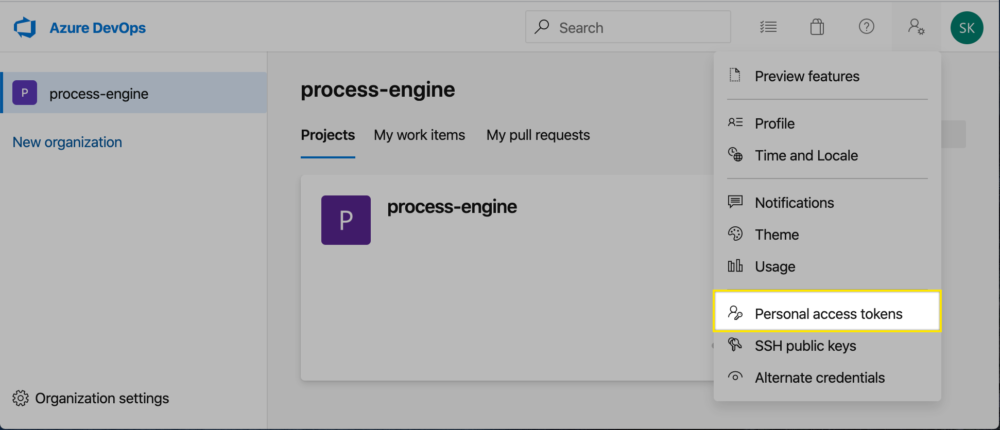
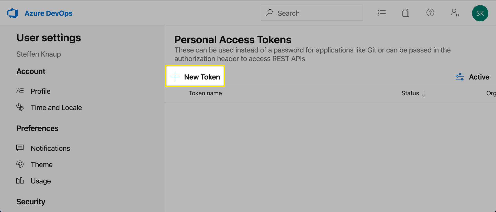
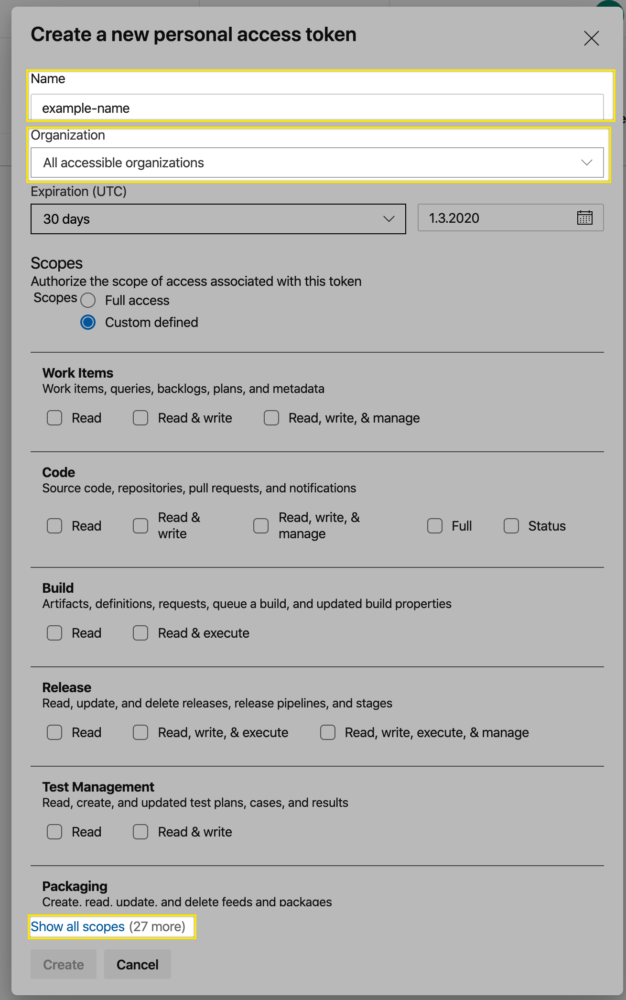
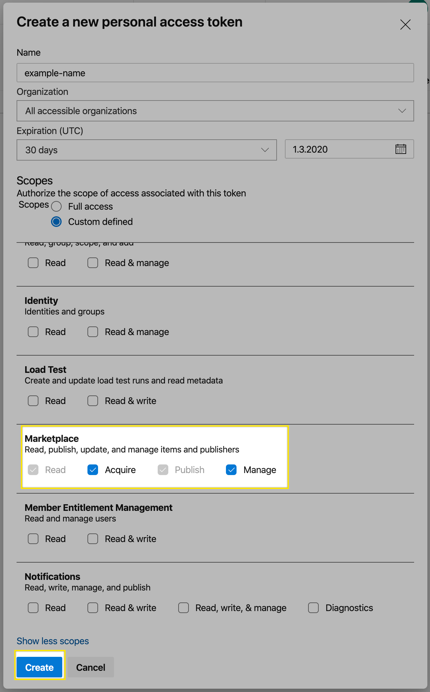
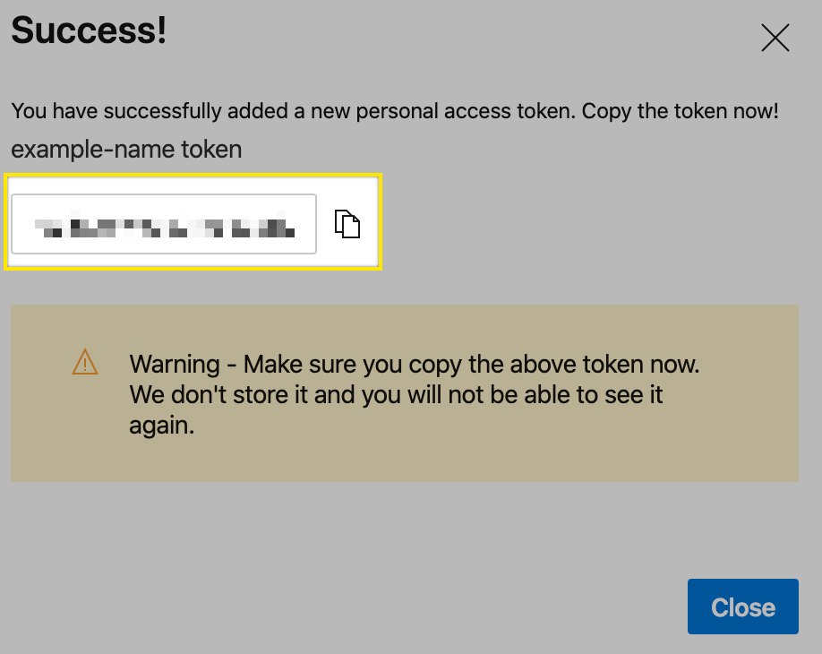
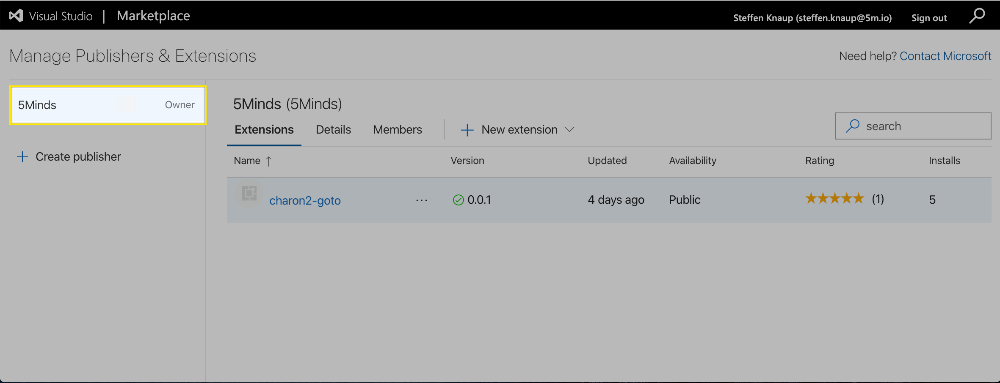

# Publishing

Publishing this package is as easy as executing these two commands:

```
vsce package
vsce publish
```

But in order to be able to publish this extension, some preparations have to be made.

## Get a Personal Access Token

1. Navigate to https://dev.azure.com/process-engine

1. [Create a new personal access token](https://dev.azure.com/process-engine/_usersSettings/tokens)


1. Click on `New Token`.


1. **Select `All accessible organizations` as Organization**, enter any name and **click on `Show all scopes`**.


1. Scroll down to `Marketplace` and select `Acquire` and `Manage`.


1. Copy the newly created personal access token via the copy button.


## Install vsce

[vsce](https://github.com/microsoft/vscode-vsce), short for "Visual Studio Code Extensions", is a command-line tool for packaging, publishing and managing VS Code extensions.

To install vsce, run the following line
```
npm i -g vsce
```

## Log in to a publisher

First make sure you are a member of the 5Minds publisher by navigating to https://marketplace.visualstudio.com/manage.



Run the following command and enter the previously created personal access token when prompted.

```
vsce login
```

Now you are ready to publish this extension.

> If you are not a member of the 5Minds publisher, please contact the ProzessPiraten team.
